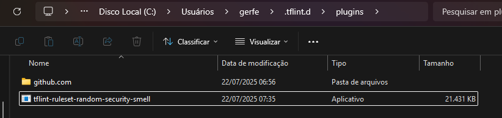

## Configurar o plugin
Necessário que o *Name* definido no main.go seja exatamente igual ao que vem no sufixo do tflint-ruleset.
Dessa forma, o comando abaixo ficaria tflint-ruleset-security-smell

Necessário rodar o comando
```go build -o tflint-ruleset-security-smell.exe```
ou esse
```GOOS=windows GOARCH=amd64 go build -o tflint-ruleset-security-smell.exe```

## Cria o arquivo .tflint.hcl
Nele define o caminho para o plugin
```
plugin "security-smell" {
    enabled = "true"
    path = "~/.tflint.d/plugins/tflint-ruleset-security-smell"
}
```



Aqui é importante destacar que deve-se abstrair o prefixo tflint-ruleset na linha do plugin, mesmo que o .exe contenha esse prefixo.
Se não colocar, o tflint não vai identificar corretamente.
Então, o arquivo .tflint.hcl ficaria assim:

plugin "security-smell" {
    enabled = true
}

## Gerar checksum
sha256sum tflint-ruleset-teste_windows_amd64.zip > checksums.txt

## Referência de template
https://github.com/terraform-linters/tflint-ruleset-template/blob/main/rules/aws_instance_example_type.go

## Rodar de maneira recursiva o comando
tflint --recursive 